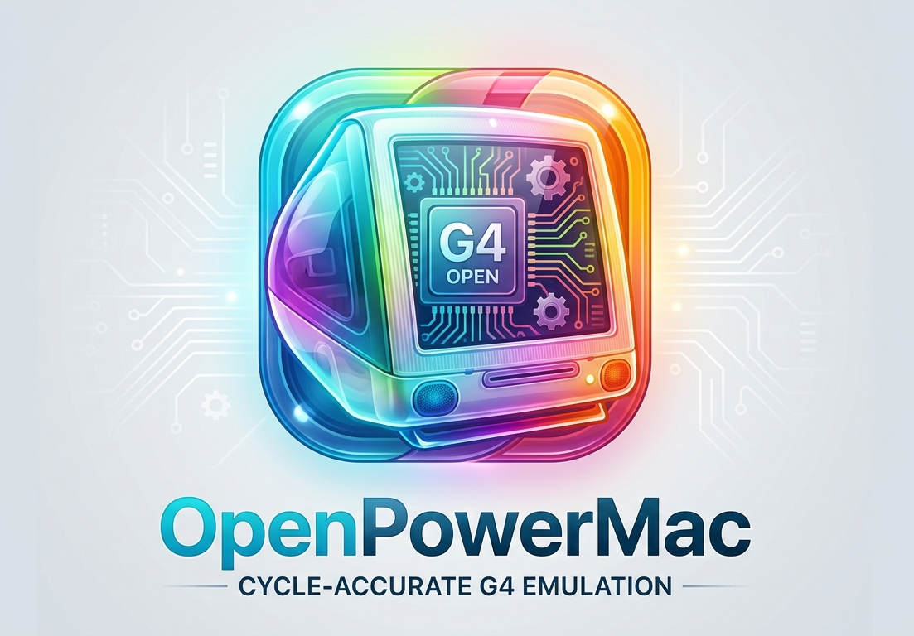

<p align="center">
  
</p>

# OpenPowerMac

A from-scratch Power Macintosh emulator.

**It installs Mac OS 9 onto a disk it creates, and boots that disk to the desktop.** The
machine runs Apple's own Open Firmware out of a real Boot ROM image, brings up the Rage 128
Pro, and hands over to Mac OS — which drives the display through its own driver at
640×480×32, enumerates USB keyboard and mouse, and plays sound through the AWACS codec.

The whole storage path works end to end: create a blank disk in the app, initialise it with
Drive Setup from the installation CD, run the installer, eject the CD, and boot from it.
The guest's clock is paced from the host, so a guest second is a real second and the 60 Hz
tick chain runs at 60 Hz regardless of how fast the emulator itself is.

Design, methodology, and the provenance ledger live in the
[wiki](https://github.com/codingncaffeine/OpenPowerMac/wiki).

No Apple software is included or distributed. ROMs and operating system media must be
supplied by the user from their own hardware.

The Boot ROM is the 1 MB image of a Power Mac G4 (AGP Graphics) — firmware 4.2.8f1 and
3.2.4f1 are both known to boot. A ROM read out of a machine carries that machine's
system-configuration block alongside the firmware; a ROM assembled from Apple's firmware
updater carries a template block describing a different board instead, which sends the
firmware off to wait on hardware this machine does not have. The emulator recognises that
case, configures the block as a Sawtooth's before power-on, and says so in the console.

## Where it is

**Arc 1 — a complete MPC7400 (PowerPC G4) CPU core — is done.** Every instruction,
register, exception, and MMU behaviour, implemented from the processor's own documentation
(the Motorola/NXP user's manuals, the PowerPC Programming Environments Manual, and the
AltiVec Technology manuals) rather than from any other emulator. Integer, floating point on
a from-scratch integer-only softfloat, all 162 AltiVec instructions, the hashed-page MMU
with BATs, the full exception model, and true little-endian mode.

**Arc 2 — the machine — boots.** A Power Mac G4 AGP: Uni-North host bridges and their three
PCI buses, a PCI-to-PCI bridge carrying KeyLargo, ATA/ATAPI with DBDMA and bus-snooped DMA,
the OpenPIC interrupt controller, the PMU, an ATI Rage 128 Pro driven by its own FCode ROM,
and two OHCI USB controllers with boot-protocol HID devices.

| | |
|---|---|
| Open Firmware | boots to the prompt and auto-boots from disk |
| Mac OS 9 | installs from CD onto an emulated disk, and boots from it to the desktop |
| Storage | ATA/ATAPI with DBDMA and bus-snooped DMA; disks are created in the app |
| Display | the OS binds its own driver and sets 640×480×32 |
| Input | USB keyboard and mouse enumerate and reach the guest |
| Sound | the startup chime and system audio play through the AWACS codec |
| Timing | the guest's clock is paced from the host — a guest second is a real second |
| 3D | not yet started |

The desktop is reached and usable for a time; keeping it stable indefinitely is the
current work. Later arcs: a JIT, higher display resolutions, and register-level 3D on the
Rage 128 so the guest's own driver does the translation.

## How it is verified

The CPU core is held to a standard the machine layer is still growing into:

- **SST-PPC** — a single-step test suite authored for this project (no public PowerPC
  equivalent existed): 330 chapters, ~33,000 vectors, byte-identical from MSVC and GCC
  builds.
- **Known-answer tests** — 240 hand-derived vectors covering instruction semantics,
  exception entry state, and the MMU protection matrix.
- **A differential oracle** — the same programs built by a PowerPC cross-compiler and run
  against a host build, compared bit for bit at two optimisation levels.
- **Bare-metal proofs** — supervisor and demand-paging kernels whose output must match
  byte for byte.
- **A determinism gate** — floating point is a from-scratch softfloat with no host FP and
  no `fenv`, so results are identical across compilers by construction.

Every hardware behaviour the machine relies on is recorded in the wiki's
[Receipts](https://github.com/codingncaffeine/OpenPowerMac/wiki/Clean-Room-Receipts)
ledger with its source tier and how it was verified.

## Building

Requires CMake and a C++20 compiler (MSVC and GCC are both kept green).

```
cmake -S . -B build -DCMAKE_BUILD_TYPE=Release
cmake --build build --config Release
ctest --test-dir build -C Release
```

`tools/g4run` is the machine's command-line front end and carries the instrumentation used
to bring it up. The Windows GUI (`shell/`, WPF on .NET) builds separately once the native
library exists — it picks `opmcapi.dll` up from `shell/native/`:

```
cd shell
dotnet build -c Release
```

## License

MIT — see [LICENSE](LICENSE).
